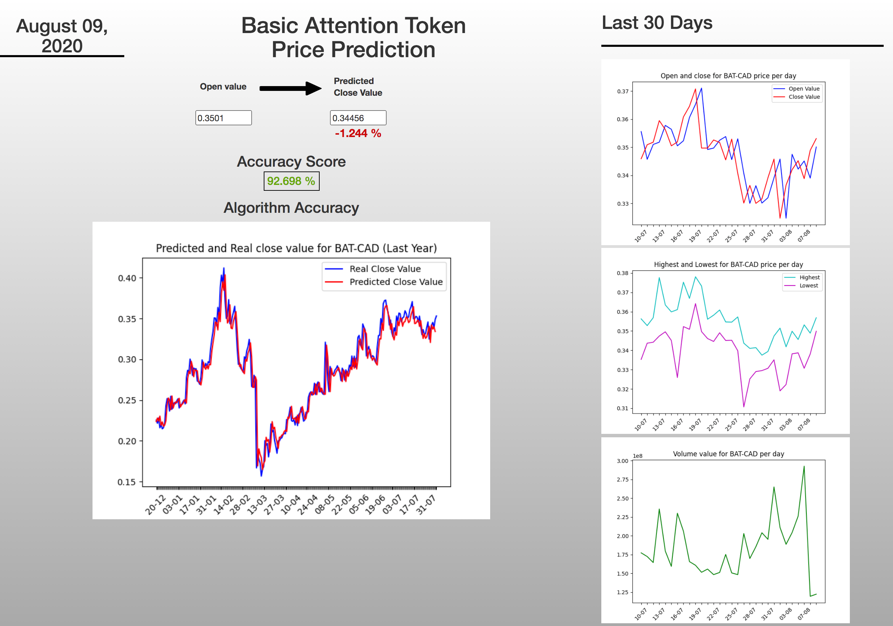
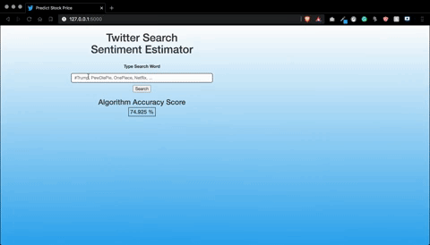
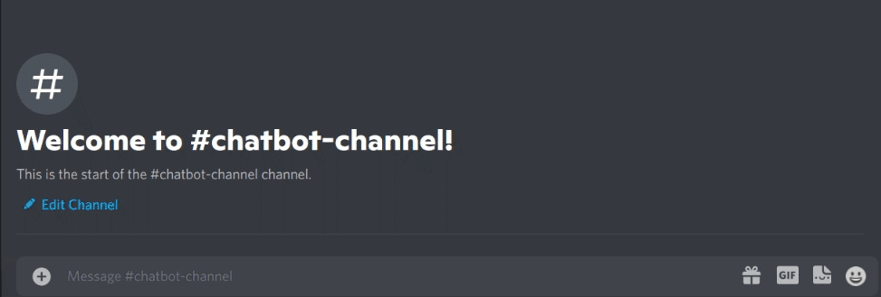

# My Machine Learning Projects.

## Projects

### Predict BAT CryptoCurrency Close value

* [Access Repository](https://github.com/Scylidose/ml-projects/tree/master/Predict_Stock_Prices)  

  

Will predict the close value of the Basic Attention Token currency based on its open value.

- Recurrent Neural Network, Long Short-Term Memory.  

- Flask, Jinja, CSS, JavaScript.

### Estimate the Global Sentiment behind Tweets

* [Access Repository](https://github.com/Scylidose/ml-projects/tree/master/Sentiment_Estimator)  

Fetch some Tweets based on a given input and will estimate the global sentiment behind it.

- Logistic Regression.  

- Flask, Jinja, CSS, JavaScript.

### Classify SMS messages

* [Access Repository](https://github.com/Scylidose/ml-projects/tree/master/SMS_Classifier) 

Classify SMS messages as either *ham* or *spam*.

- Python

### Generate Pokemon Songs

* [Access Repository](https://github.com/Scylidose/ml-projects/tree/master/Generate_Music) 

Will generate either a Battle, Route or Building song based on the fourth generation (Platinum/Diamond/Perl) of the Pokemon games.

- Gated Recurrent Units, Long Short-Term Memory.

- Flask, Jinja, CSS, JavaScript.

### Discord Bot

* [Access Repository](https://github.com/Scylidose/ml-projects/tree/master/Discord_Bot) 

Display a bot on Discord that will listen to the user's input and repeat a sentence for a specific number of times and in the targeted channel.

- Python, Heroku, SQL.

### FeelinBot (WIP)

* [Access Repository](https://github.com/Scylidose/ml-projects/tree/master/FeelinBot) 

Display a bot on Facebook Messenger that will listen to the user's input and analyze the general sentiment behind certain sentences.

- Python.

- Heroku, Firebase, Facebook Messenger, DialogFlow.
